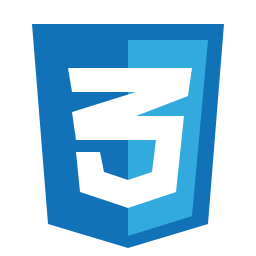
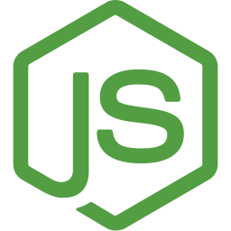
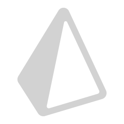
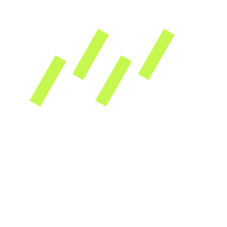
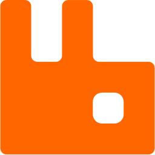

<h1 align="center">Hi 👋, I'm Serkan</h1>
<h4 align="center">🌱 I am a Full-Stack Developer who adopts ASP.NET-Core, React, React-Native-Expo, Nextjs &Nestjs technologies</h4>
<h1 align="center">⚡My Fellow Travelers</h1>

  
  
  
  
  
  
  
  
  
  
  
  
  
  

  
  
  
  
  
  
  
  
  
  
  
  
  
  
  
  
  

